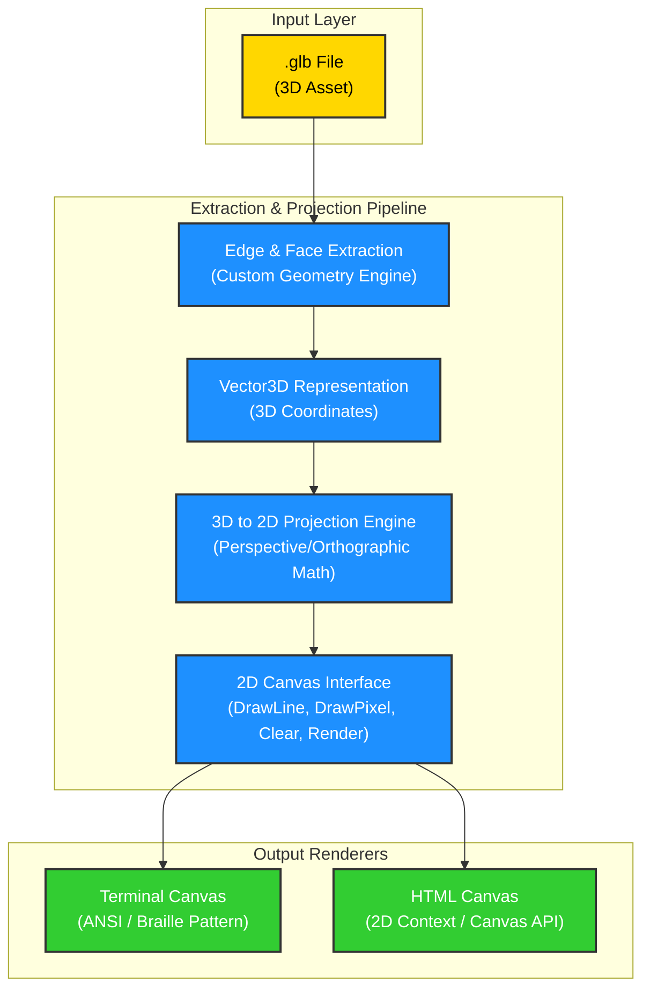

# 📦 asset-cat

> Render 3D `.glb` asset edges and faces directly in your terminal and browser with a custom-built Go projection engine.

---

`asset-cat` is a lightweight, zero-dependency Go application designed to parse 3D Binary glTF (`.glb`) assets, extract their structural wireframes (vertices, edges, and faces), project them using custom perspective/orthographic matrices, and render them onto abstract 2D canvases—specifically a **Terminal screen** (using ANSI escape codes and sub-character Braille characters) and an **HTML5 Canvas** (streamed via WebSockets).

---

## 🚀 The Rendering Pipeline

The following diagram illustrates how a 3D asset flows from a raw binary file to the 2D visual outputs:



---

## 🛠️ Tech Stack & Key Decisions

Architectural decisions are tracked using [Architecture Decision Records (ADRs)](design/decisions/architecture/):

1. **Go (Golang)**: Chosen as the core programming language for efficiency, high performance on matrix arithmetic, and single-binary portability with zero external system dependencies. ([ADR 0002](design/decisions/architecture/0002-use-go-as-the-primary-programming-language.md))
2. **Custom Math & Projection Engine**: To keep the repository lightweight and decoupled from heavy engines like Godot, the 3D-to-2D projection math and matrix translations are custom-written. ([ADR 0003](design/decisions/architecture/0003-pipeline-for-3d-wireframe-rendering.md))
3. **Decoupled 2D Canvas Target**: An abstract `Canvas2D` Go interface delegates rasterization/drawing, enabling clean plug-and-play behavior for rendering to terminal emulators or browser clients over WebSockets. ([ADR 0004](design/decisions/architecture/0004-terminal-and-html-canvas-rendering-interfaces.md))

---

## 📂 Project Directory Structure

```text
.
├── design/
│   └── decisions/
│       └── architecture/     # Architecture Decision Records (ADRs)
│           ├── 0001-record-architecture-decisions.md
│           ├── 0002-use-go-as-the-primary-programming-language.md
│           ├── 0003-pipeline-for-3d-wireframe-rendering.md
│           └── 0004-terminal-and-html-canvas-rendering-interfaces.md
├── LICENSE
└── README.md                 # This file
```

---

## 🌟 Features Breakdown

- **GLB Parser**: Decodes the binary glTF specification, reading meshes, buffer views, accessors, and indices directly.
- **Matrix Projection**: Implementation of projection formulas:
  - **Perspective**: Emulates real-world cameras with fields of view (FOV) and foreshortening.
  - **Orthographic**: Parallel projection useful for technical drafts and CAD-like visualizations.
- **Terminal Rasterizer**: Converts lines to Braille patterns (using Unicode symbols from `0x2800` to `0x28FF`) to achieve $2\times4$ sub-pixel terminal resolution.
- **Websocket Broadcast**: Streams coordinates in real-time to an attached browser window, updating an HTML5 canvas context smoothly at 60 FPS.
