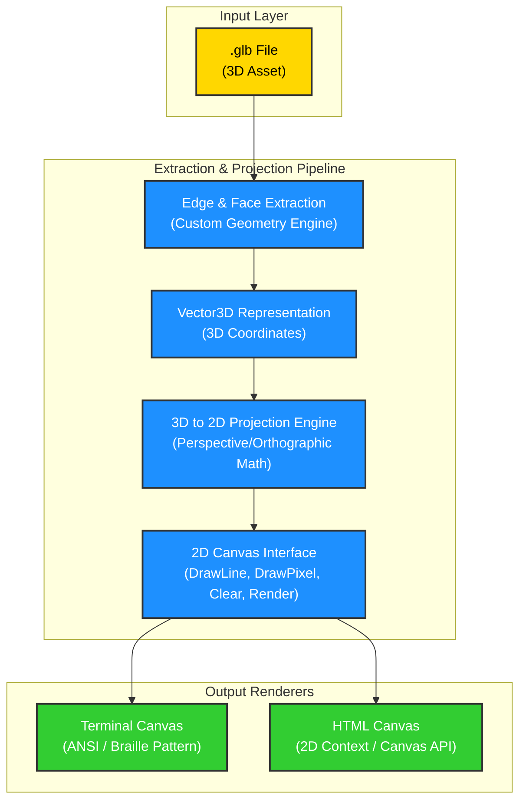

# 📦 asset-cat

> Render 3D `.glb` asset edges and faces directly in your terminal and browser with a custom-built Go projection engine.

[](https://www.youtube.com/watch?v=SGVlBuH37Xw)

---

`asset-cat` is a lightweight Go application that parses 3D Binary glTF (`.glb`) assets, extracts their structural wireframes (vertices, edges, and faces), projects them using a custom perspective projection engine, and renders them onto abstract 2D canvases — specifically a **Terminal screen** (using ANSI escape codes and sub-character Braille patterns) and an **HTML5 Canvas** (streamed via WebSockets).

> Inspired by the elegantly simple 3D projection formula `x/z, y/z` explored by tsoding in [this video](https://www.youtube.com/watch?v=qjWkNZ0SXfo)

---

## 🚀 Quick Start

### Install

```bash
go install github.com/noddingSloth/asset-cat/cmd/asset-cat@latest
```

### Usage

```bash
# Render a model in your terminal
asset-cat --input model.glb

# Pipe from stdin
cat model.glb | asset-cat

# Extract geometry as JSON
asset-cat json --input model.glb > model.json

# Start the web viewer
asset-cat serve --input model.glb
# Then open http://localhost:8080
```

### Subcommands

| Command | Description |
|---------|-------------|
| `run` (default) | Render rotating wireframe in terminal |
| `json` | Output extracted vertices, edges, and faces as JSON |
| `serve` | Start WebSocket server for browser-based viewing |

---

## 🚀 The Rendering Pipeline

The following diagram illustrates how a 3D asset flows from a raw binary file to the 2D visual outputs:



---

## 🛠️ Tech Stack & Key Decisions

Architectural decisions are tracked using [Architecture Decision Records (ADRs)](design/decisions/architecture/):

1. **Go (Golang)**: Chosen as the core programming language for efficiency, high performance on matrix arithmetic, and single-binary portability. ([ADR 0002](design/decisions/architecture/0002-use-go-as-the-primary-programming-language.md))
2. **Custom Math & Projection Engine**: To keep the repository lightweight and decoupled from heavy engines, the 3D-to-2D projection math and matrix transformations are custom-written. ([ADR 0003](design/decisions/architecture/0003-pipeline-for-3d-wireframe-rendering.md))
3. **Decoupled 2D Canvas Target**: An abstract `Canvas2D` Go interface delegates rasterization/drawing, enabling clean plug-and-play behavior for rendering to terminal emulators or browser clients over WebSockets. ([ADR 0004](design/decisions/architecture/0004-terminal-and-html-canvas-rendering-interfaces.md))
4. **Static Geometry Extractor Scope**: Restrict the GLB extractor to static wireframe geometry (vertices, edges, and faces), explicitly omitting animations, skins, materials, and textures. ([ADR 0005](design/decisions/architecture/0005-restrict-glb-extractor-to-static-geometry-only.md))

---

## 📂 Project Directory Structure

```text
.
├── assets/                   # Sample GLB files and source documentation
│   └── tux/
│       ├── source.txt        # Model metadata
│       └── tux.glb           # Sample 3D model (Tux penguin)
├── cmd/
│   └── asset-cat/
│       └── main.go           # Application entrypoint & CLI
├── design/
│   └── decisions/
│       └── architecture/     # Architecture Decision Records (ADRs)
├── internal/
│   ├── geom/                 # 3D Math & Geometry Engine
│   │   ├── vector3.go        # 3D vector with Add, Sub, Cross, Dot, Normalize
│   │   ├── matrix4.go        # 4x4 matrix: rotate, translate, perspective, lookAt
│   │   └── camera.go         # View/projection matrix generation
│   ├── extractor/            # GLB parsing and geometry extraction
│   │   ├── glb.go            # Binary glTF container parser
│   │   └── mesh.go           # Mesh/Model structs with bounding box
│   ├── canvas/               # 2D Render Output Abstractions
│   │   ├── canvas.go         # Canvas2D interface
│   │   ├── terminal/         # Braille sub-pixel terminal renderer
│   │   │   ├── terminal.go   # ANSI escape codes, fixed-position rendering
│   │   │   └── braille.go    # Unicode Braille dot grid (U+2800-U+28FF)
│   │   └── html/             # WebSocket coordinate broadcaster
│   │       └── server.go     # gorilla/websocket multi-client server
│   └── pipeline/             # Pipeline orchestrator
│       └── engine.go         # Extraction → projection → canvas cycle
├── web/                      # HTML5 Canvas visualizer frontend
│   ├── index.html
│   ├── style.css             # Green-on-black wireframe aesthetic
│   └── app.js                # WebSocket client + requestAnimationFrame loop
├── go.mod
├── Taskfile.yml
├── LICENSE
└── README.md
```

---

## 🌟 Features

- **GLB Parser**: Decodes the binary glTF 2.0 specification — reads meshes, buffer views, accessors, and index arrays directly from the container format.
- **Geometry Extraction**: Extracts vertex positions (`VEC3`), triangular faces, and deduplicated edges. Supports both indexed and non-indexed primitives with `uint16`/`uint32` index types.
- **Bounding Box Computation**: Calculates axis-aligned bounding box across all meshes for automatic camera positioning and viewport scaling.
- **Perspective Projection**: Custom 4×4 matrix math — rotation, translation, lookAt view matrix, and perspective projection with configurable FOV.
- **Terminal Rasterizer**: Converts projected 2D lines to Braille dot patterns (Unicode `U+2800`–`U+28FF`) achieving 2×4 sub-pixel resolution per terminal character.
- **Auto-scaling Viewport**: Detects terminal size and adjusts scale factor to fill available space. Reserves top row for status bar showing filename and dimensions.
- **WebSocket Broadcast**: Streams projected line coordinates in real-time to browser clients. Green wireframe on black background at smooth framerates.
- **JSON Export**: Serialize extracted model geometry (vertices, edges, faces, bounding box) for use in other tools.
- **Stdin Support**: Pipe `.glb` data directly: `cat model.glb | asset-cat`

---

## 📄 License

[MIT](LICENSE)